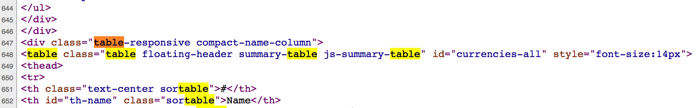

# More Real Life Examples {#Moreexamples}

```{r message=FALSE,echo=FALSE}
library(rvest)
library(tidytext)
library(dplyr)
library(ggplot2)
library(rtweet)
library(tidyr)
library(wordcloud)
library(tidyquant)
```


Okay. This is a tour of some sites that will serve as important examples on how to parse sites. Let's check the price of bitcoins. You want to be rich don't you ? 

## BitCoin Prices


{width=650px}

{width=750px}

```{r}
library(rvest)
url <- "https://coinmarketcap.com/all/views/all/"
bc <- read_html(url)

path <- '//*[@id="currencies-all"]'
 bc_table <- bc %>% html_nodes(xpath=path) %>% html_table()
 # We get back a one element list that is a data frame
 str(bc_table,0)
 bc_table <- bc_table[[1]]
 head(bc_table[,3:5])
```

```{r}
# The data is "dirty" and has characers in it that need cleaning
bc_table <- bc_table %>% select(Name,Symbol,Price)
bc_table <- bc_table %>% mutate(Name=gsub("\n"," ",Name))
bc_table <- bc_table %>% mutate(Name=gsub("\\.+","",Name))
bc_table <- bc_table %>% mutate(Price=gsub("\\$","",Price))
bc_table <- bc_table %>% mutate(Price=round(as.numeric(Price),2))

# There are four rows wherein the Price is missing NA
bc_table <- bc_table %>% filter(complete.cases(bc_table))

# Let's get the Crypto currencies with the Top 10 highest prices 
top_10 <- bc_table %>% arrange(desc(Price)) %>% head(10)

# Next we want to make a barplot of the Top 10
ylim=c(0,max(top_10$Price)+10000)
main="Top 10 Crypto Currencies in Terms of Price"
bp <- barplot(top_10$Price,col="aquamarine",
              ylim=ylim,main=main)
axis(1, at=bp, labels=top_10$Symbol,  cex.axis = 0.7)
grid()
# Let's take the log of the price
ylim=c(0,max(log(top_10$Price))+5)
main="Top 10 Crypto Currencies in Terms of log(Price)"
bp <- barplot(log(top_10$Price),col="aquamarine",
              ylim=ylim,main=main)
axis(1, at=bp, labels=top_10$Symbol,  cex.axis = 0.7)
grid()
```

## Faculty Salaries


```{r}
url <- "https://www.insidehighered.com/aaup-compensation-survey"
df <- read_html(url) %>% html_table() %>% `[[`(1)
intost <- c("Institution","Category","State")
salary <- df %>% separate(InstitutionCategoryState,into=intost,sep="\n") 
salary
```


So we could process multiple pages


```{r eval=FALSE}
# So now we could process multiple pages

url <- 'https://www.insidehighered.com/aaup-compensation-survey?institution-name=&professor-category=1591&page=1'
str1 <- "https://www.insidehighered.com/aaup-compensation-survey?"
str2 <- "institution-name=&professor-category=1591&page="
intost <- c("Institution","Category","State")

salary <- data.frame()
for (ii in 1:2) {
  nurl  <- paste(str1,str2,ii,sep="")
  df <- read_html(nurl)
  tmp <- df %>% html_table() %>% `[[`(1)
  tmp <- tmp %>% separate(InstitutionCategoryState,into=intost,sep="\n") 
  salary <- rbind(salary,tmp)
}

salary

```


Look at the URLs at the bottom of the main page to find beginning and ending page numbers. Visually this is easy. Programmatically we could  do something like the following:


```{r eval=FALSE}
# https://www.insidehighered.com/aaup-compensation-survey?page=1
# https://www.insidehighered.com/aaup-compensation-survey?page=94

# What is the last page number ? We already know the answer - 94

lastnum <- df %>% html_nodes(xpath='//a') %>% 
  html_attr("href") %>% '['(103) %>%
  strsplit(.,"page=") %>% '[['(1) %>% '['(2) %>% as.numeric(.)

# So now we could get all pages of the survey

str1 <- "https://www.insidehighered.com/aaup-compensation-survey?"
str2 <- "institution-name=&professor-category=1591&page="
intost <- c("Institution","Category","State")

salary <- data.frame()

for (ii in 1:lastnum) {
  nurl  <- paste(str1,str2,ii,sep="")
  df <- read_html(nurl)
  tmp <- df %>% html_table() %>% `[[`(1)
  tmp <- tmp %>% separate(InstitutionCategoryState,into=intost,sep="\n") 
  salary <- rbind(salary,tmp)
  Sys.sleep(1)
}
names(salary) <- c("Institution","Category","State","AvgSalFP","AvgChgFP",
                   "CntFP","AvgTotCompFP","SalEquityFP")

salary <- salary %>% 
  mutate(AvgSalFP=as.numeric(gsub("\\$|,","",salary$AvgSalFP))) %>%
  mutate(AvgTotCompFP=as.numeric(gsub("\\$|,","",salary$AvgTotCompFP)))

salary %>% group_by(State,Category) %>% 
  summarize(avg=mean(AvgSalFP)) %>% 
  arrange(desc(avg))
```

There are some problems:

* Data is large and scattered across multiple pages
* We could use above techniques to move from page to page
* There is a form we could use to narrow criteria
* But we have to programmatically submit the form
* rvest (and other packages) let you do this

## Filling Out Forms From a Program

{width=250px}

Let's find salaries between $ 150,000 and the default max ($ 244,000)

* Find the element name associated with "Average Salary"
* Establish a connection with the form (usually the url of the page)
* Get a local copy of the form
* Fill in the value for the "Average Salary"
* Submit the  lled in form
* Get the results and parse them like above
`

So finding the correct element is more challenging. I use Chrome to do this. Just highlight the area over the form and right click to "Insepct" the element. This opens up the developer tools. You have to dig down to find the corrext form and the element name. Here is a screen shot of my activity:

{width=550px}

```{r}

url <- "https://www.insidehighered.com/aaup-compensation-survey"

# Establish a session
mysess <- html_session(url)

# Get the form

form_unfilled <- mysess %>% html_node("form") %>% html_form()
form_filled   <- form_unfilled %>% set_values("range-from"=150000)

# Submit form

results <- submit_form(mysess,form_filled)
first_page <- results %>% html_nodes(xpath=expr) %>% html_table()

first_page
```


## PubMed

Pubmed provides a rich source of information on published scientific literature. There are tutorials on how to leverage its capabilities but one thing to consider is that MESH terms are a good starting place since the search is index-based. MeSH (Medical Subject Headings) is the NLM controlled vocabulary thesaurus used for indexing articles for PubMed. It's faster and more accurate so you can first use the MESH browser to generate the appropriate search terms and add that into the Search interface. The MESH browser can be found at https://www.ncbi.nlm.nih.gov/mesh/

{width=550px}


{width=550px}


```{r}
url <- "https://www.ncbi.nlm.nih.gov/pubmed/?term=%22hemodialysis%2C+home%22+%5BMeSH+Terms%5D"

# 

results <- read_html(url) %>% 
  html_nodes("a") %>% 
  html_attr("href") %>%
  grep("/pubmed/[0-9]{1,6}",.,value=TRUE) %>% unique(.)

results
```

{width=550px}

So now we could loop through these links and get the abstracts for these results. It looks that there are approximately 10 results per page. As before we would have to dive in to the underlying structure of the page to get the correct XML pathnames or we could look for Paragraph elements and pick out the links that way. 

```{r}

text.vec <- vector()

for (ii in 1:length(results)) {
  string <- paste0("https://www.ncbi.nlm.nih.gov",results[ii])
  text.vec[ii] <- read_html(string) %>% html_nodes("p") %>% `[[`(10) %>% html_text()
}

# Eliminate lines with newlines characters

final.vec <- text.vec[grep("^\n",text.vec,invert=TRUE)]

final.vec
```


Well that was a lot of work and it's very tedious. And we procssed only the first page of results. How do we "progrmmatically" hit the "Next" Button at the bottom of the page ? This is complicated by the fact that there appears to be some Javascript at work that we would have to somehow interact with to get the URL for the next page. Unlike with the school salary example it isn't obvious how to do this. If we hove over the "Next" button we don't get an associated link.

