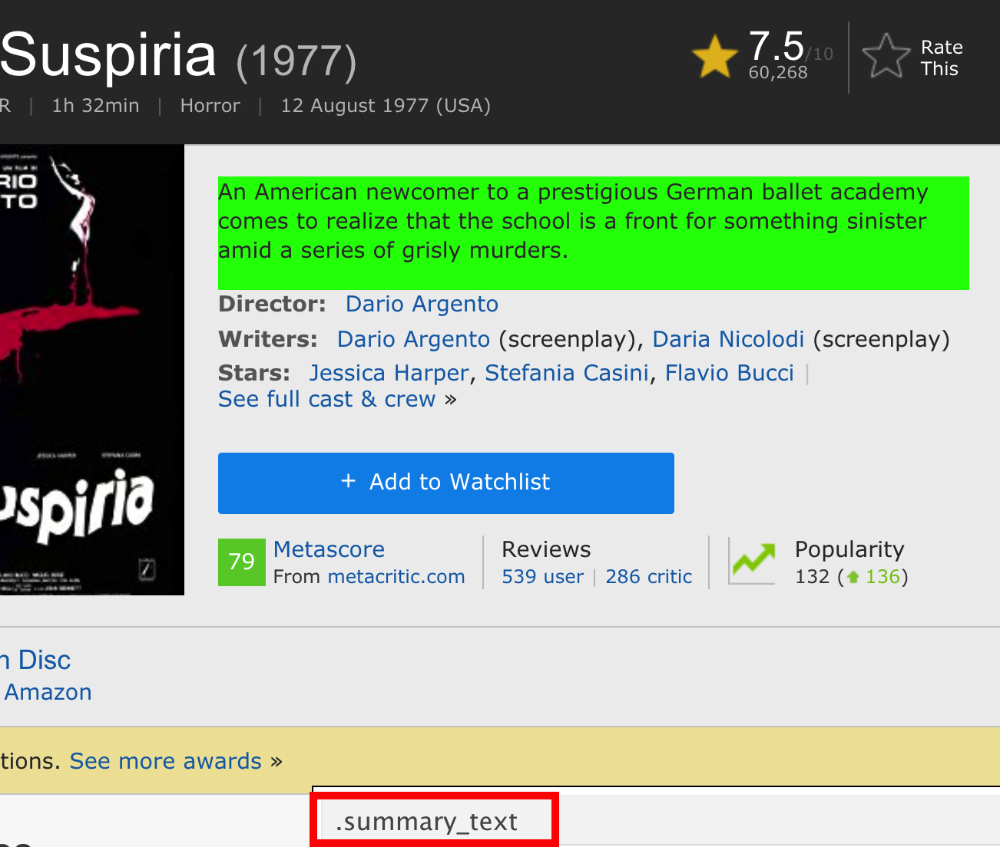
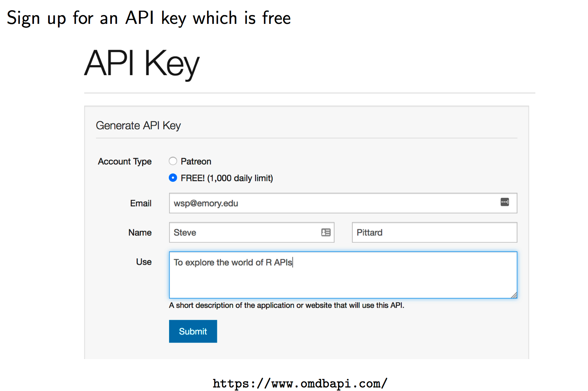
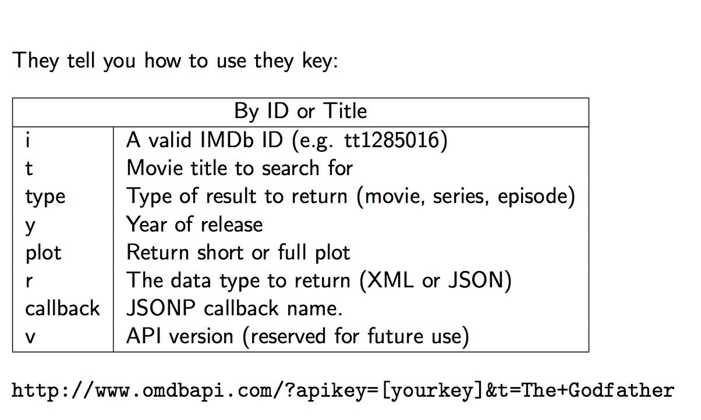
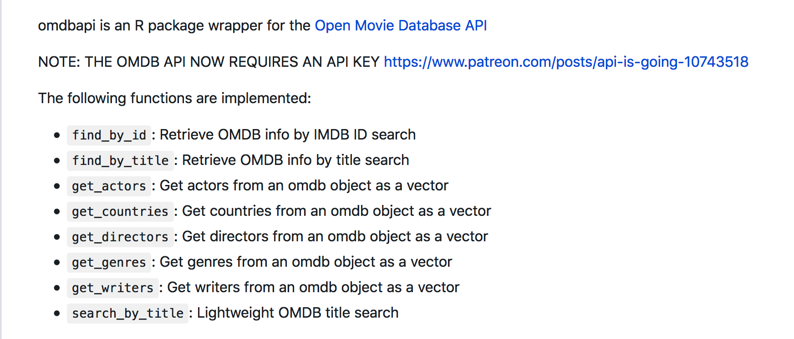
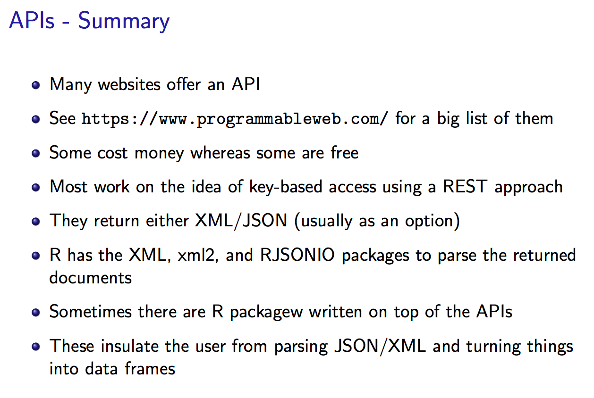
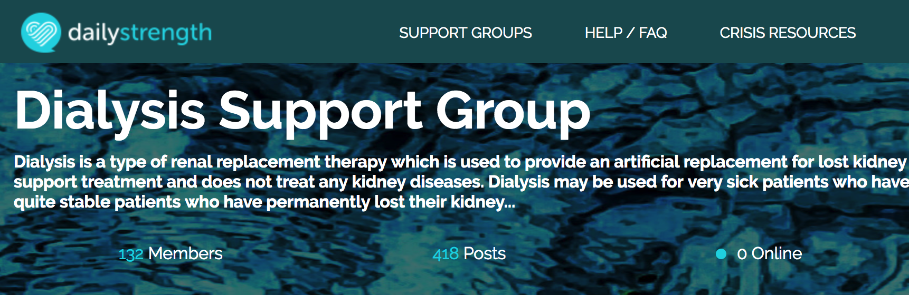
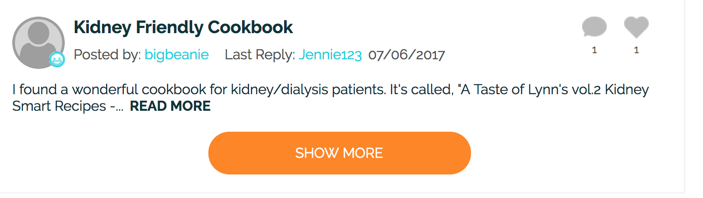
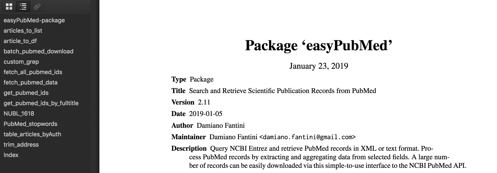

# APIs {#APIs}


## OMDB 
Let's look at the IMDB page whic catalogues lots of information about movies. Just got to the web site and search although here is an example link. https://www.imdb.com/title/tt0076786/?ref_=fn_al_tt_2 In this case we would like to get the summary information for the movie. So we would use Selector Gadget or some other method to find the XPATH or CSS associated with this element. 

{width=450px}

This pretty easy and doesn't present much of a problem although for large scale mining of movie data we would run into trouble because IMDB doesn't really like you to scrape their pages. They have an API that they would like for you to use. 

```{r imdb, eval=FALSE}
url <- 'https://www.imdb.com/title/tt0076786/?ref_=fn_al_tt_2'
summary <- read_html(url) %>% 
  html_nodes(".summary_text") %>%
  html_text()

summary
```

But here we go again. We have to parse the desired elements on this page and then what if we wanted to follow other links or set up a general function to search IMDB for other movies of various genres, titles, directors, etc. 


{width=550px}


{width=450px}


{width=450px}


***
So as an example on how this works. Paste the URL into any web browser. You must supply your key for this to work. What you get back is a JSON formatted entry corresponding to ”The GodFather”movie.

***

```{r godfather, eval=FALSE}
url <- "http://www.omdbapi.com/?apikey=f7c004c&t=The+Godfather"


```

{width=650px}


```{r jsongf}
library(RJSONIO)

url <- "http://www.omdbapi.com/?apikey=f7c004c&t=The+Godfather"

# Fetch the URL via fromJSON
movie <- fromJSON("http://www.omdbapi.com/?apikey=f7c004c&t=The+Godfather")

# We get back a list which is much easier to process than raw JSON or XML
str(movie)
```


```{r movie}
movie$Plot

sapply(movie$Ratings,unlist)
```

Let’s Get all the Episodes for Season 1 of Game of Thrones

```{r got}
url <- "http://www.omdbapi.com/?apikey=f7c004c&t=Game%20of%20Thrones&Season=1"
movie <- fromJSON(url)
str(movie,1)
episodes <- data.frame(do.call(rbind,movie$Episodes),stringsAsFactors = FALSE)
episodes

```


## The omdbapi package 

Wait a minute. Looks like someone created an R package that wraps all this for us. It is called omdbapi

{width=650px}


```{r omdbapi, eval=FALSE}
# Use devtools to install
devtools::install_github("hrbrmstr/omdbapi")
```

```{r searchombd}
library(omdbapi)
# The first time you use this you will be prompted to enter your
 # API key
movie_df <- search_by_title("Star Wars", page = 2)
(movie_df <- movie_df[,-5])


# Get lots of info on The GodFather

(gf <- find_by_title("The GodFather"))

# Get the actors from the GodFather
get_actors((gf))
```

{width=550px}

## RSelenium

Sometimes we interact with websites that use Javascript to load more text or comments in a user forum. Here is an example of that. Look at https://www.dailystrength.org/group/dialysis which is a website associated with people wanting to share information about dialysis. 



If you check the bottom of the pag you will see a button. 




```{r rselen, eval=FALSE}
# https://www.dailystrength.org/group/dialysis

library(RSelenium)
library(rvest)
library(tm)
library(SentimentAnalysis)
library(wordcloud)

url <- "https://www.dailystrength.org/group/dialysis"

# The website has a "show more" button that hides most of the patient posts
# If we don't find a way to programmatically "click" this button then we can
# only get a few of the posts and their responses. To do this we need to
# use the RSelenium package which does a lot of behind the scenes work

# See https://cran.r-project.org/web/packages/RSelenium/RSelenium.pdf
# http://brazenly.blogspot.com/2016/05/r-advanced-web-scraping-dynamic.html

# Open up a connection 

# rD <- rsDriver()
# So, you might have to specify the version of chrome you are using
# For someone reason this seems now to be necessary (11/4/19)

rD <- rsDriver(browser=c("chrome"),chromever="78.0.3904.70")
remDr <- rD[["client"]]
remDr$navigate(url)

loadmorebutton <- remDr$findElement(using = 'css selector', "#load-more-discussions")

# Do this a number of times to get more links

loadmorebutton$clickElement()

# Now get the page with more comments and questions

page_source <- remDr$getPageSource()

# So let's parse the contents

comments <- read_html(page_source[[1]])

cumulative_comments <- vector()

links <- comments %>% html_nodes(css=".newsfeed__description")  %>% 
  html_node("a") %>% html_attr("href")

full_links <- paste0("https://www.dailystrength.org",links)

if (length(grep("NA",full_links)) > 0) {
  full_links <- full_links[-grep("NA",full_links)]
}

ugly_xpath <- '//*[contains(concat( " ", @class, " " ), concat( " ", "comments__comment-text", " " ))] | //p'

for (ii in 1:length(full_links)) {
  text <- read_html(full_links[ii]) %>% 
    html_nodes(xpath=ugly_xpath) %>% 
    html_text() 
  length(text) <- length(text) - 1
  text <- text[-1]
  
  text
  
  cumulative_comments <- c(cumulative_comments,text)
}

remDr$close()
# stop the selenium server
rD[["server"]]$stop()

```


## EasyPubMed

So there is an R package called *EasyPubMed* that helps ease the access of data on the Internet. The idea behind this package is to be able to query NCBI Entrez and retrieve PubMed records in XML or TXT format.  




The PubMed records can be downloaded and saved as XML or text files if desired.  According to the package authours, "Data integrity is enforced during data download, allowing to retrieve and save very large number of records effortlessly". The bottom line is that you can do what you want after that. Let's look at an example involving home hemodialysis


```{r ezpub}
library(easyPubMed)
```

Let's do some searching

```{r echo=FALSE}
my_abstracts <- readRDS("my_abstracts")

```


```{r ezpubmed, eval=FALSE}
my_query <- 'hemodialysis, home" [MeSH Terms]'
my_entrez_id <- get_pubmed_ids(my_query)

my_abstracts <- fetch_pubmed_data(my_entrez_id)
my_abstracts <- custom_grep(my_abstracts,"AbstractText","char")


my_abstracts[1:3]

[1] "Assisted PD (assPD) is an option of home dialysis treatment for dependent 
end-stage renal patients and worldwide applied in different countries since more 
than 40 years. China and Germany shares similar trends in demographic development 
with a growing proportion of elderly referred to dialysis treatment. So far number 
of patients treated by assPD is low in both countries. We analyze experiences in 
the implementation process, barriers, and benefits of ass PD in the aging population 
to provide a model for sustainable home dialysis treatment with PD in both countries. Differences and similarities of different factors (industrial, patient and facility 
based) which affect utilization of assPD are discussed. AssPD should be promoted in 
China and Germany to realize the benefits of home dialysis for the aging population 
by providing a structured model of implementation and quality assurance."                                                                                                


[2] "End-stage renal disease (ESRD) is the final stage of chronic kidney disease 
in which the kidney is not sufficient to meet the needs of daily life. It is necessary 
to understand the role of genes expression involved in ESRD patient responses to 
nocturnal hemodialysis (NHD) and to improve the immunity responsiveness. The aim of 
this study was to investigate novel immune-associated genes that may play important 
roles in patients with ESRD.The microarray expression profiles of peripheral blood 
in patients with ESRD before and after NHD were analyzed by network-based approaches, 
and then using Gene Ontology (GO) and Kyoto Encyclopedia of Genes and Genomes 
pathway analysis to explore the biological process and molecular functions of 
differentially expressed genes. Subsequently, a transcriptional regulatory network 
of the core genes and the connected transcriptional regulators was constructed. 
We found that NHD had a significant effect on neutrophil activation and immune 
response in patients with ESRD.In addition, Our findings suggest that MAPKAPK3, 
RHOA, ARRB2, FLOT1, MYH9, PRKCD, RHOG, PTPN6, MAPK3, CNPY3, PI3KCG, and PYGL 
genes maybe potential targets regulated by core transcriptional factors, 
including ARNT, C/EBPalpha, CEBPA, CREB1, PSG1, DAND5, SP1, GATA1, MYC, EGR2, 
and EGR3." 

[3] "Only a minority of patients with chronic kidney disease treated by 
hemodialysis are currently treated at home. Until relatively recently, the 
only type of hemodialysis machine available for these patients was a slightly 
smaller version of the standard machines used for in-center dialysis treatments. 
Areas covered: There are now an alternative generation of dialysis machines 
specifically designed for home hemodialysis. The home dialysis patient wants 
a smaller machine, which is intuitive to use, easy to trouble shoot, robust 
and reliable, quick to setup and put away, requiring minimal waste disposal. 
The machines designed for home dialysis have some similarities in terms of 
touch-screen patient interfaces, and using pre-prepared cartridges to speed 
up setting up the machine. On the other hand, they differ in terms of whether 
they use slower or standard dialysate flows, prepare batches of dialysis fluid, 
require separate water purification equipment, or whether this is integrated, 
or use pre-prepared sterile bags of dialysis fluid. Expert commentary: Dialysis 
machine complexity is one of the hurdles reducing the number of patients opting 
for home hemodialysis and the introduction of the newer generation of dialysis 
machines designed for ease of use will hopefully increase the number of patients 
opting for home hemodialysis."

```


