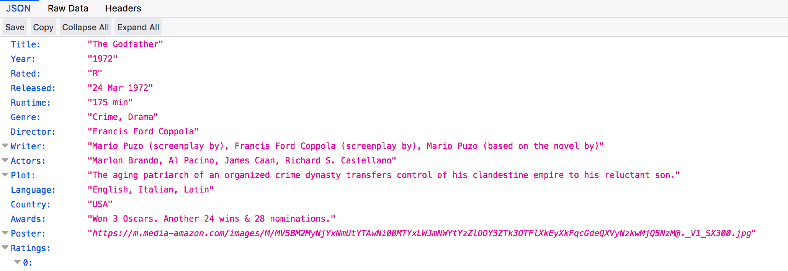

# APIs {#APIs}


## OMDB 
Let's look at the IMDB page whic catalogues lots of information about movies. Just got to the web site and search although here is an example link. https://www.imdb.com/title/tt0076786/?ref_=fn_al_tt_2 In this case we would like to get the summary information for the movie. So we would use Selector Gadget or some other method to find the XPATH or CSS associated with this element. 

{width=450px}

This pretty easy and doesn't present much of a problem although for large scale mining of movie data we would run into trouble because IMDB doesn't really like you to scrape their pages. They have an API that they would like for you to use. 

```{r eval=FALSE}
url <- 'https://www.imdb.com/title/tt0076786/?ref_=fn_al_tt_2'
summary <- read_html(url) %>% 
  html_nodes(".summary_text") %>%
  html_text()
```

But here we go again. We have to parse the desired elements on this page and then what if we wanted to follow other links or set up a general function to search IMDB for other movies of various genres, titles, directors, etc. 


{width=550px}


{width=450px}


{width=450px}


***
So as an example on how this works. Paste the URL into any web browser. You must supply your key for this to work. What you get back is a JSON formatted entry corresponding to ”The GodFather”movie.

***

```{r eval=FALSE}
url <- "http://www.omdbapi.com/?apikey=f7c004c&t=The+Godfather"


```

{width=650px}


```{r}
library(RJSONIO)

url <- "http://www.omdbapi.com/?apikey=f7c004c&t=The+Godfather"

# Fetch the URL via fromJSON
movie <- fromJSON("http://www.omdbapi.com/?apikey=f7c004c&t=The+Godfather")

# We get back a list which is much easier to process than raw JSON or XML
str(movie)
```


```{r}
movie$Plot

sapply(movie$Ratings,unlist)
```

Let’s Get all the Episodes for Season 1 of Game of Thrones

```{r}
url <- "http://www.omdbapi.com/?apikey=f7c004c&t=Game%20of%20Thrones&Season=1"
movie <- fromJSON(url)
str(movie,1)
episodes <- data.frame(do.call(rbind,movie$Episodes),stringsAsFactors = FALSE)
episodes

```


## The omdbapi package 

Wait a minute. Looks like someone created an R package that wraps all this for us. It is called omdbapi

{width=650px}


```{r eval=FALSE}
# Use devtools to install
devtools::install_github("hrbrmstr/omdbapi")
```

```{r}
library(omdbapi)
# The first time you use this you will be prompted to enter your
 # API key
movie_df <- search_by_title("Star Wars", page = 2)
(movie_df <- movie_df[,-5])


# Get lots of info on The GodFather

(gf <- find_by_title("The GodFather"))

# Get the actors from the GodFather
get_actors((gf))
```

{width=550px}

## RSelenium

Sometimes we interact with websites that use Javascript to load more text or comments in a user forum. Here is an example of that. Look at https://www.dailystrength.org/group/dialysis which is a website associated with people wanting to share information about dialysis. 


If you check the bottom of the pag you will see a button. 


```{r eval=FALSE}
# https://www.dailystrength.org/group/dialysis

library(RSelenium)
library(rvest)
library(tm)
library(SentimentAnalysis)
library(wordcloud)

url <- "https://www.dailystrength.org/group/dialysis"

# The website has a "show more" button that hides most of the patient posts
# If we don't find a way to programmatically "click" this button then we can
# only get a few of the posts and their responses. To do this we need to
# use the RSelenium package which does a lot of behind the scenes work

# See https://cran.r-project.org/web/packages/RSelenium/RSelenium.pdf
# http://brazenly.blogspot.com/2016/05/r-advanced-web-scraping-dynamic.html

# Open up a connection 

rD <- rsDriver()
remDr <- rD[["client"]]
remDr$navigate(url)

loadmorebutton <- remDr$findElement(using = 'css selector', "#load-more-discussions")

# Do this a number of times to get more links

loadmorebutton$clickElement()

# Now get the page with more comments and questions

page_source <- remDr$getPageSource()

# So let's parse the contents

comments <- read_html(page_source[[1]])

cumulative_comments <- vector()

links <- comments %>% html_nodes(css=".newsfeed__description")  %>% 
  html_node("a") %>% html_attr("href")

full_links <- paste0("https://www.dailystrength.org",links)

if (length(grep("NA",full_links)) > 0) {
  full_links <- full_links[-grep("NA",full_links)]
}

ugly_xpath <- '//*[contains(concat( " ", @class, " " ), concat( " ", "comments__comment-text", " " ))] | //p'

for (ii in 1:length(full_links)) {
  text <- read_html(full_links[ii]) %>% 
    html_nodes(xpath=ugly_xpath) %>% 
    html_text() 
  length(text) <- length(text) - 1
  text <- text[-1]
  
  text
  
  cumulative_comments <- c(cumulative_comments,text)
}

remDr$close()
# stop the selenium server
rD[["server"]]$stop()

```


## EasyPubMed

So there is an R package called *EasyPubMed* that helps ease the access of data on the Internet. The idea behind this package is to be able to query NCBI Entrez and retrieve PubMed records in XML or TXT format.  The PubMed records can be downloaded and saved as XML or text files if desired.  According to the package authours, "Data integrity is enforced during data download, allowing to retrieve and save very large number of records effortlessly". The bottom line is that you can do what you want after that. Let's look at an example involving home hemodialysis


```{r}
library(easyPubMed)
```

Let's do some searching

```{r}
my_query <- 'hemodialysis, home" [MeSH Terms]'
my_entrez_id <- get_pubmed_ids(my_query)
my_abstracts_txt <- fetch_pubmed_data(my_entrez_id, format = "abstract")
my_abstracts_txt[1:20]

my_abstracts_xml <- fetch_pubmed_data(my_entrez_id)

```


Well the results aren't bad but we still have to parse out some junk but nothing like before. It's a minor problem. In this case the API gives us some XML back that we then have to parse. 

```{r}
my_abstracts <- unlist(xpathApply(my_abstracts_xml, "//AbstractText", saveXML))

# Still have to clear out some junk in each abstract

my_abstracts <- gsub('<(.*)">',"",my_abstracts)
my_abstracts <- gsub('<AbstractText>|</AbstractText>',"",my_abstracts)

length(my_abstracts)

```

But we have around 935 abstracts that we can now mess with. The benefit of this approach is that we dont' have to do all the text conversions and manipulations that we would have with the manual approach. Plus, we are able to get a lot more results more conveniently. 

```{r}
my_abstracts[1:3]
```


