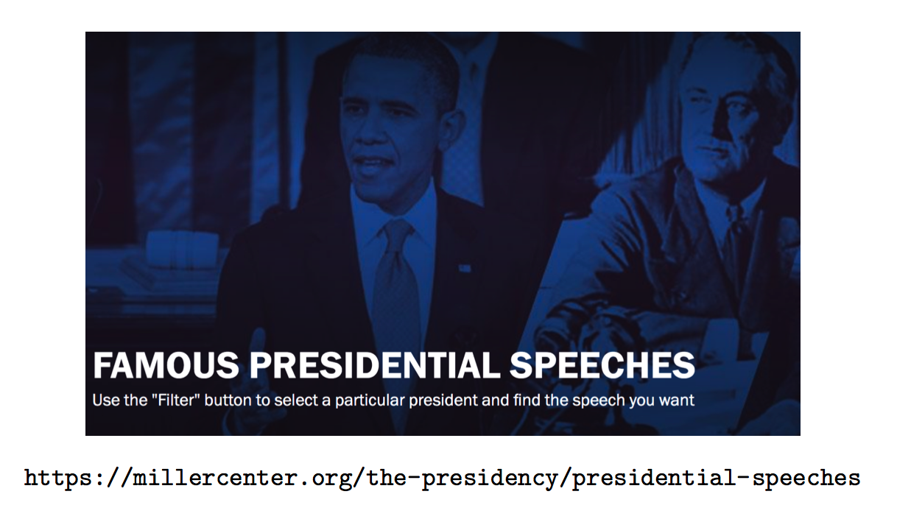

# Bag of Words Sentiment Analysis {#bagofwords}

One we have a collection of text it's interesting to figure out what it might mean or infer - if anything at all. In text analysis and NLP (Natural Language Processing) we talk about "Bag of Words" to describe a collection or "corpus" of unstructured text. What do we do with a "bag of words" ? 

* Extract meaning from collections of text (without reading !) 
* Detect and analyze patterns in unstructured textual collections 
* Use Natural Language Processing techniques to reach conclusions 
* Discover what ideas occur in text and how they might be linked
* Determine if the discovered patterns be used to predict behavior ? 
* Identify interesting ideas that might otherwise be ignored


## Workflow

* Identify and Obtain text (e.g. websites, Twitter, Databases, PDFs, surveys) 
* Create a text ”Corpus”- a structure that contains the raw text
* Apply transformations:
    + Normalize case (convert to lower case)
    + Remove puncutation and stopwords
    + Remove domain specific stopwords
* Perform Analysis and Visualizations (word frequency, tagging, wordclouds) 
* Do Sentiment Analysis


R has Packages to Help. These are just some of them:

* QDAP - Quantitative Discourse Package
* tm - text mining applications within R
* tidytext - Text Mining using ddplyr and ggplot and tidyverse tools 
* SentimentAnalysis - For Sentiment Analysis

However, consider that:

* Some of these are easier to use than others
* Some can be kind of a problem to install (e.g. qdap) 
* They all offer similar capabilities
* We’ll look at tidytext


## Simple Example

{width=650px}


Find the URL for Lincoln’s March 4, 1865 Speech:

```{r}
url <- "https://millercenter.org/the-presidency/presidential-speeches/march-4-1865-second-inaugural-address"
library(rvest)
lincoln_doc <- read_html(url) %>%
                    html_nodes(".view-transcript") %>%
                    html_text()
lincoln_doc

```


There are probably lots of words that don't really "matter" or contribute to the "real" meaning of the speech. 

```{r}
word_vec <- unlist(strsplit(lincoln_doc," "))
word_vec[1:20]
sort(table(word_vec),decreasing = TRUE)[1:10]
```

How do we remove all the uninteresting words ? We could do it manaully

```{r}
# Remove all punctuation marks
word_vec <- gsub("[[:punct:]]","",word_vec)
stop_words <- c("the","to","and","of","the","for","in","it",
                "a","this","which","by","is","an","hqs","from",
                "that","with","as")
for (ii in 1:length(stop_words)) {
    for (jj in 1:length(word_vec)) {
      if (stop_words[ii] == word_vec[jj]) {
          word_vec[jj] <- ""
} }
}
word_vec <- word_vec[word_vec != ""]
sort(table(word_vec),decreasing = TRUE)[1:10]
word_vec[1:30]
```

## tidytext

A better way would be to use the tidytext package. First we need to create a data frame out of the text. Then we "tokenize" the text which means we have one line per word. 

```{r}
library(tidytext)

text_df <- data_frame(line = 1:length(lincoln_doc), text = lincoln_doc)
token_text <- text_df %>%
  unnest_tokens(word, text)

token_text %>% count(word,sort=TRUE)

```

But we need to get rid of the "stop words"


```{r}
# Now remove stop words
data(stop_words)
tidy_text <- token_text %>%
  anti_join(stop_words)

# This could also be done by the following. I point this out only because some people react
# negatively to "joins" although fully understanding what joins are can only help you since
# much of what the dplyr package does is based on SQL type joins. 

tidy_text <- token_text %>%
  filter(!word %in% stop_words$word)

tidy_text %>% count(word,sort=TRUE)
```

```{r}
tidy_text %>% count(word,sort=TRUE)

tidy_text %>%
  count(word, sort = TRUE) %>%
  filter(n > 2) %>%
  mutate(word = reorder(word, n)) %>%
  ggplot(aes(word, n)) +
  geom_col() +
  xlab(NULL) +
  coord_flip()
```

## Back To The PubMed Example

We have around 935 abstracts that we can now mess with

```{r}
# Create a data frame out of the cleaned up abstracts

text_df <- data_frame(line = 1:length(my_abstracts), text = my_abstracts)
token_text <- text_df %>%
  unnest_tokens(word, text)

# Many of these words aren't helpful 
token_text %>% count(total=word,sort=TRUE)

# Now remove stop words
data(stop_words)
tidy_text <- token_text %>%
  anti_join(stop_words)

# This could also be done by the following. I point this out only because some people react
# negatively to "joins" although fully understanding what joins are can only help you since
# much of what the dplyr package does is based on SQL type joins. 

tidy_text <- token_text %>%
  filter(!word %in% stop_words$word)

# Arrange the text by descending word frequency 

tidy_text %>%
  count(word, sort = TRUE) 
```

Some of the most frequently occurring words are in fact "dialysis", "patients" so maybe we should consider them to be stop words also since we already know quite well that the overall theme is, well, dialysis and kidneys. There are also synonymns and abbreviations that are somewhat redundant such as "pdd","pd","hhd" so let's eliminate them also. 


```{r}
tidy_text <- token_text %>%
   filter(!word %in% c(stop_words$word,"dialysis","patients","home","kidney",
                       "hemodialysis","haemodialysis","patient","hhd",
                       "pd","peritoneal","hd","renal","study","care",
                       "ci","chd","nhd","disease"))

tidy_text %>%
  count(word, sort = TRUE) 
```


Let's do some plotting of these words


```{r}
tidy_text %>%
  count(word, sort = TRUE) %>%
  filter(n > 120) %>%
  mutate(word = reorder(word, n)) %>%
  ggplot(aes(word, n)) +
  geom_col() +
  xlab(NULL) +
  coord_flip()
```


Okay, it looks like there are numbers in there which might be useful. I suspect that the "95" is probably associated with the idea of a confidence interval. But there are other references to numbers. 

```{r}
grep("^[0-9]{1,3}$",tidy_text$word)[1:20]

tidy_text_nonum <- tidy_text[grep("^[0-9]{1,3}$",tidy_text$word,invert=TRUE),]

```


Okay well I think maybe we have some reasonable data to examine. As you might have realized by now, manipulating data to get it "clean" can be tedious and frustrating though it is an inevitable part of the process. 

```{r}
tidy_text_nonum %>%
  count(word, sort = TRUE) %>%
  filter(n > 120) %>%
  mutate(word = reorder(word, n)) %>%
  ggplot(aes(word, n)) +
  geom_col() +
  xlab(NULL) +
  coord_flip()
```


```{r}
nrc_joy <- get_sentiments("nrc") %>% 
  filter(sentiment == "joy")

bing_word_counts <- tidy_text_nonum %>% 
  inner_join(get_sentiments("nrc")) %>% 
  count(word,sentiment,sort=TRUE)
```


t the positive vs negative words

```{r}
bing_word_counts %>%
  group_by(sentiment) %>%
  top_n(10) %>%
  ungroup() %>%
  mutate(word = reorder(word, n)) %>%
  ggplot(aes(word, n, fill = sentiment)) +
  geom_col(show.legend = FALSE) +
  facet_wrap(~sentiment, scales = "free_y") +
  labs(y = "Contribution to sentiment",
       x = NULL) +
  coord_flip()
```


Let's create a word cloud


```{r message=FALSE, warning=FALSE}
library(wordcloud)
#

tidy_text_nonum %>%  
  count(word) %>%
  with(wordcloud(word,n,max.words=100,colors=brewer.pal(8,"Dark2")))
```

## BiGrams

Let's look at bigrams. We need to go back to the cleaned abstracts and pair words to get phrase that might be suggestive of some sentiment


```{r}
text_df <- data_frame(line = 1:length(my_abstracts), text = my_abstracts)
dialysis_bigrams <- text_df %>%
  unnest_tokens(bigram, text, token = "ngrams", n = 2)

dialysis_bigrams %>%
  count(bigram, sort = TRUE)

```


But we have to filter out stop words

```{r}
bigrams_sep <- dialysis_bigrams %>% 
  separate(bigram,c("word1","word2"),sep=" ")

stop_list <- c(stop_words$word,"dialysis","patients","home","kidney",
                       "hemodialysis","haemodialysis","patient","hhd",
                       "pd","peritoneal","hd","renal","study","care",
                       "ci","chd","nhd","esrd","lt","95","0.001")

bigrams_filtered <- bigrams_sep %>% 
  filter(!word1 %in% stop_list) %>%
  filter(!word2 %in% stop_list)

bigram_counts <- bigrams_filtered %>% 
  count(word1, word2, sort = TRUE)

bigrams_united <- bigrams_filtered %>%
  unite(bigram, word1, word2, sep = " ")

bigrams_united %>%  count(bigram, sort = TRUE) %>% print(n=25)
```


```{r}
bigram_counts %>%
  filter(n > 30) %>%
  ggplot(aes(x = reorder(word1, -n), y = reorder(word2, -n), fill = n)) +
    geom_tile(alpha = 0.8, color = "white") +
    scale_fill_gradientn(colours = c(palette_light()[[1]], palette_light()[[2]])) +
    coord_flip() +
    theme_tq() +
    theme(legend.position = "right") +
    theme(axis.text.x = element_text(angle = 45, vjust = 1, hjust = 1)) +
    labs(x = "first word in pair",
         y = "second word in pair")
```

