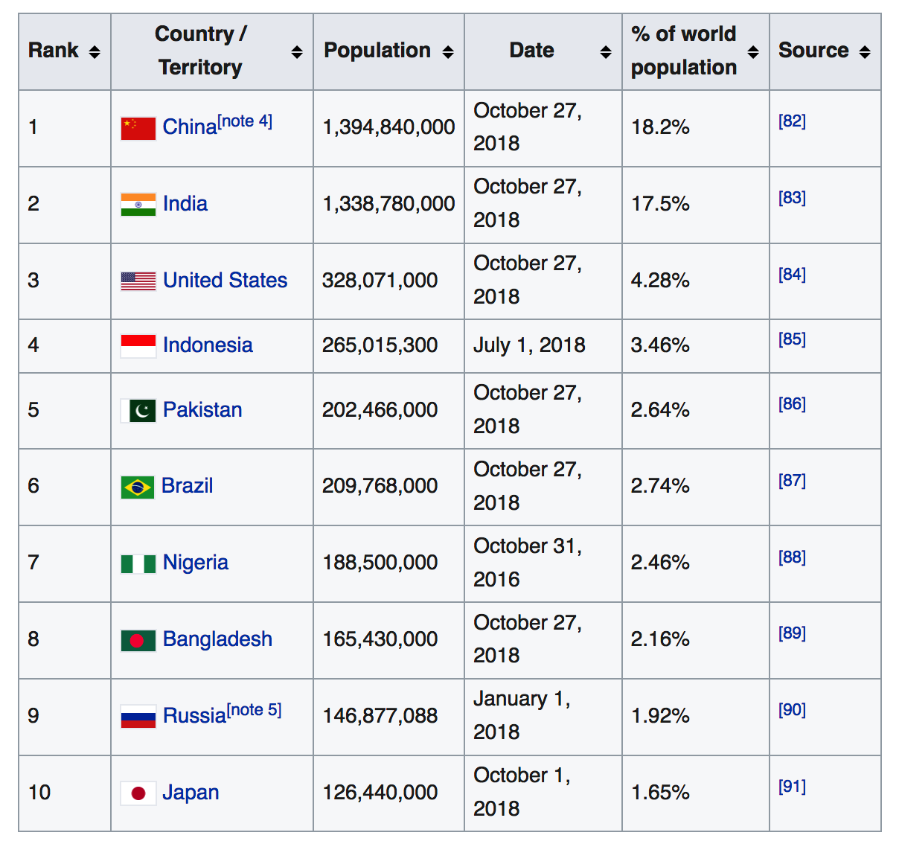

--- 
title: "Web Scraping with R"
author: "Steve Pittard"
date: "`r Sys.Date()`"
bibliography:
- book.bib
- packages.bib
description: This is in support of my talk for the Data Science group
documentclass: book
link-citations: yes
site: bookdown::bookdown_site
biblio-style: apalike
---

# Motivations

## Lots of Data For The Taking ? 

The web hosts lots of interesting data that you can ”scrape”. Some of it is stashed in data bases, behind APIs, or in free form text. Lots of people want to grab information of of Twitter or from user forums to see what people are thinking. There is a lot of valuable information out there for the taking although some web sites have "caught on" and either block programmatic access or they setup "pay walls" that require you to subscribe to an API for access. The New York Times does this. But there are lots of opportunities to get data. 

 | 
------|--------------------------------
tables|Fetch tables like from Wikipedia
forms|You can submit forms and fetch the results
css|You can access parts of a web site using style or css selectors
Tweets|Process tweets including emojis
Web Sites| User forums have lots of content
Instagram| Yes you can "scrape" photos also

## Web Scraping Can Be Ugly

Depending on what web sites you want to scrape the process can be involved and quite tedious. Many websites are very much aware that people are scraping so they offer Application Programming Interfaces (APIs) to make requests for information easier for the user and easier for the server administrators to control access. Most times the user must apply for a "key" to gain access. For premium sites, the key costs money. Some sites like Google and Wunderground (a popular weather site) allow some number of free accesses before they start charging you. Even so the results are typically returned in XML or JSON which then requires you to parse the result to get the information you want. In the best situation there is an R package that will wrap in the parsing and will return lists or data frames. 

Here is a summary:

* First. Always try to find an R package that will access a site (e.g. New York Times, Wunderground, PubMed). These packages (e.g. omdbapi, easyPubMed, RBitCoin, rtimes) provide a programmatic search interface and return data frames with little to no effort on your part. 

* If no package exists then hopefully there is an API that allows you to query the website and get results back in JSON or XML. I prefer JSON because it's "easier" and the packages for parsing JSON return lists which are native data structures to R. So you can easily turn results into data frames. You will ususally use the *rvest* package in conjunction with XML, and the RSJONIO packages. 

* If the Web site doesn't have an API then you will need to scrape text. This isn't hard but it is tedious. You will need to use *rvest* to parse HMTL elements. If you want to parse mutliple pages then you will need to use *rvest* to move to the other pages and possibly fill out forms. If there is a lot of Javascript then you might need to use RSelenium to programmatically manage the web page. 

## Understanding The Language of The Web

The Web has its own languages: HTML, CSS, Javascript

```{r eval=FALSE}
<h1>, <h2>, ..., <h6> Heading 1 and so on
<p> Paragraph elements
<ul> Unordered List
<ol> Ordered List
<li> List Element
<div> Division / Section
<table> Tables
<form> Web forms
```

So to be productive at scraping requires you to have some familiairty with HMTL XML, and CSS. Here we look at a very basic HTML file


```{r eval=FALSE}
<!DOCTYPE html>
<html>
  <body>
    <h1>My First Heading</h1>
    <p>My first paragraph.</p>
   </body>
</html>
```

{width=450px}

\   

And you could apply some styling to this courtest of the CSS language which allows you to inject styles into plain HTML:

{width=450px}

\  

{width=450px}

There are a number of tools that allow us to inspect web pages and see "what is under the hood". Warning - I just discovered that one of my favorite browser plugins to find the xpaths and/or css paths of page elements is no longer supported under Firefox or Chrome. I've found a couple of replacements but they don't work as well. I'll research it more. 

\   

| 
------|--------------------------------
Selector Gadget | http://selectorgadget.com/
Firebug | https://getfirebug.com/ (now integrated into a version of Firefox)
Google Chrome | Right click to inspect a page element 
Google Chrome | View Developer - Developer Tools
Oxygen Editor | Can obtain via the Emory Software Express Site

## Useful Packages

You will use the following three primary packages to help you get data from various web pages: *rvest*, *XML*, and *RJSONIO*. Note that you won't always use them simultaneously but you might use them in pairs or individually depending on the task at hand. 

## Quick **rvest** tutorial

Now let's do a quick *rvest* tutorial:


```{r}
url <- "https://en.wikipedia.org/wiki/World_population"

(paragraphs <- read_html(url) %>% html_nodes("p"))

```


Then we might want to actually parse out those paragraphs into text:

```{r}
paragraphs <- read_html(url) %>% html_nodes("p") %>% html_text()
paragraphs[1:10]
```


Get some other types of HTML obejects. Let's get all the "h2" HTML elements:

```{r}
read_html(url) %>% html_nodes("h2") %>% html_text()
```

## Example: Parsing A Table From Wikipedia

Look at the [Wikipedia Page](https://en.wikipedia.org/wiki/World_population) for world population:

https://en.wikipedia.org/wiki/World_population

* We can get any table we want using rvest
* We might have to experiment to figure out which one 
* Get the one that lists the ten most populous countries 
* I think this might be the 4th or 5th table on the page
* How do we get this ?

{width=450px}


First we will load packages that will help us throughout this session.

```{r message=F, echo=FALSE}
library(rvest)
library(tidytext)
library(dplyr)
library(ggplot2)
library(rtweet)
library(tidyr)
library(wordcloud)
library(tidyquant)
```

In this case we'll need to figure out what number table it is we want. We could fetch
all the tables and then experiment to find the precise one. 

```{r}
library(rvest)

# Use read_html to fetch the webpage
url <- "https://en.wikipedia.org/wiki/World_population"
ten_most_df <- read_html(url) 
  
ten_most_populous <- ten_most_df %>% 
  html_nodes("table") %>% `[[`(6) %>% html_table()

# Let's get just the first three columns
ten_most_populous <- ten_most_populous[,2:4]

# Get some content - Change the column names
names(ten_most_populous) <- c("Country_Territory","Population","Date")

# Do reformatting on the columns to be actual numerics where appropriate
ten_most_populous %>% 
  mutate(Population=gsub(",","",Population)) %>% 
  mutate(Population=round(as.numeric(Population)/1e+06))  %>%
  ggplot(aes(x=Country_Territory,y=Population)) + geom_point() + 
  labs(y = "Population / 1,000,000") + coord_flip() +
  ggtitle("Top 10 Most Populous Countries")

```

In the above example we leveraged the fact that we were looking specifically for a table element and it became a project to locate the correct table number. This isn't always the case with more complicated websites in that the element we are trying to grab or scrape is contained within a nested structure that doesn't correspond neatly to a paragraph, link, heading, or table. This can be the case if the page is heavily styled with CSS or Javascript. We might have to work harder. But it's okay to try to use simple elements and then try to refine the search some more.

## Summary

* Need some basic HTML and CSS knowledge to find correct elements
* How to extract text from common elements
* How to extract text from specific elements
* Always have to do some text cleanup of data
* It usually takes multiple times to get it right

See http://bradleyboehmke.github.io/2015/12/scraping-html-text.html


```{r include=FALSE}
# automatically create a bib database for R packages
knitr::write_bib(c(
  .packages(), 'bookdown', 'knitr', 'rmarkdown'
), 'packages.bib')
```
